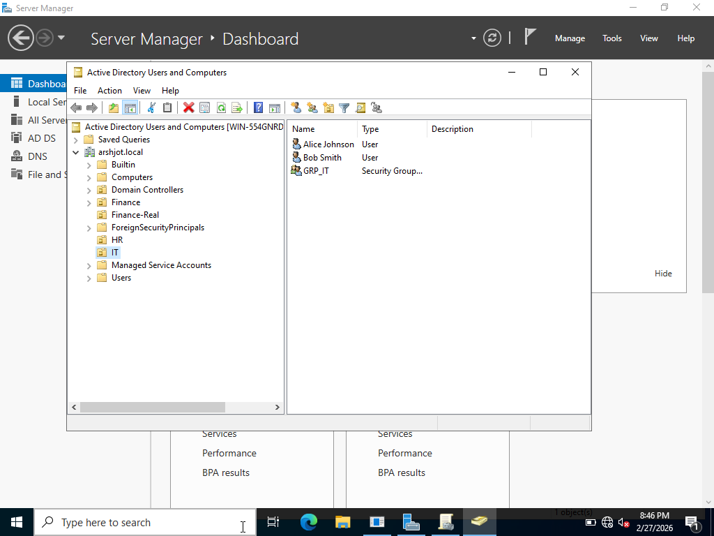
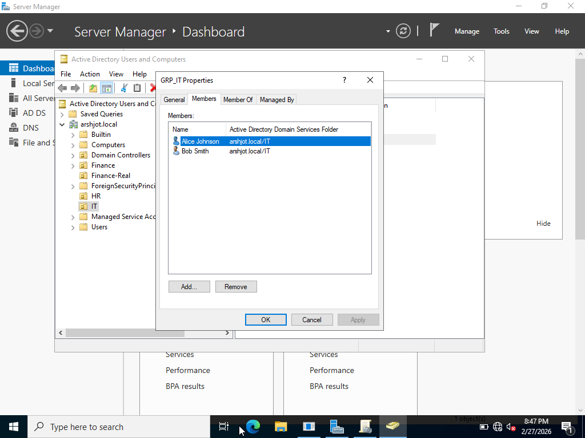
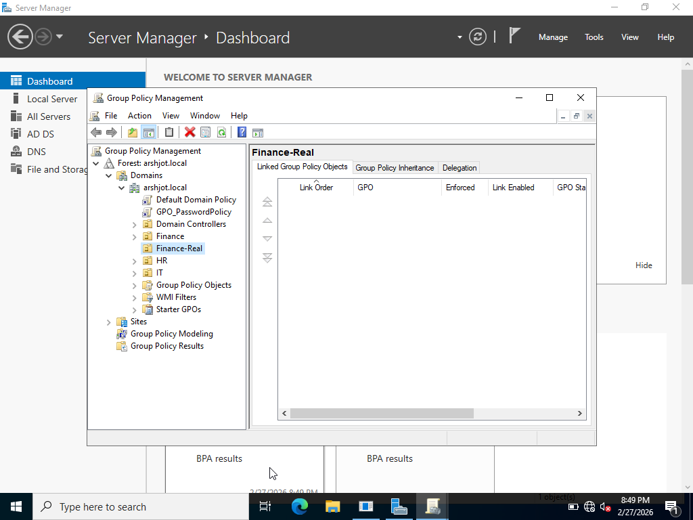
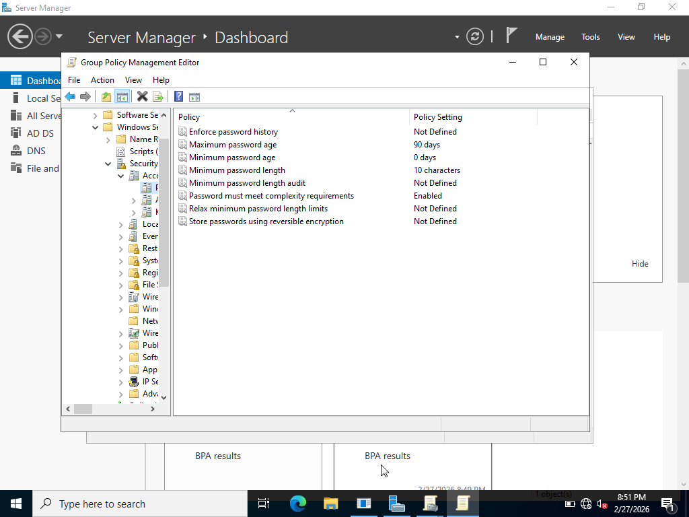
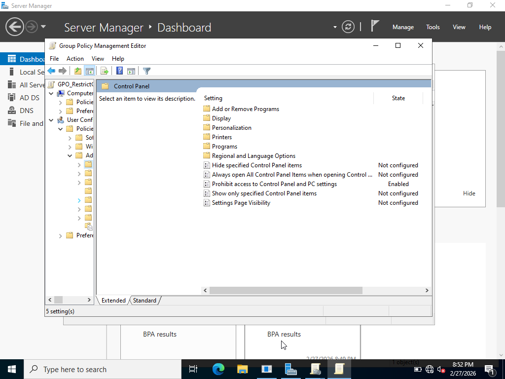
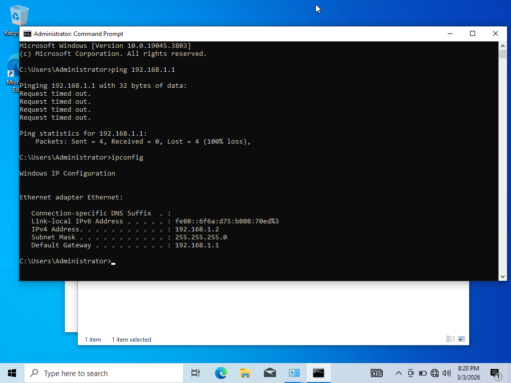
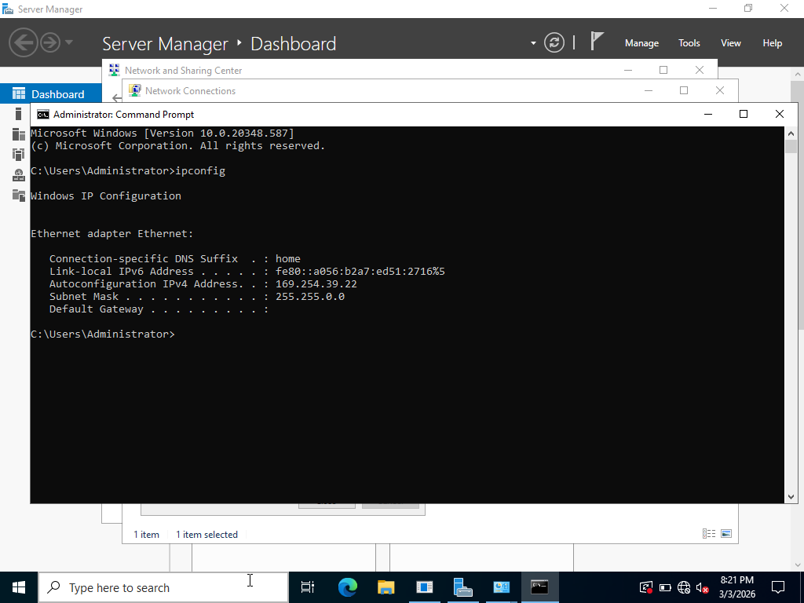

# Active Directory Home Lab — Windows Server 2022

## Overview

A self-directed home lab simulating a real enterprise Active Directory environment using VirtualBox and Windows Server 2022. This lab covers domain controller setup, organizational unit design, user and group management, Group Policy configuration, and Windows 10 client domain join — core skills required for IT Support, Service Desk, and Systems Administration roles.

---

## Environment

| Component | Details |
|---|---|
| Hypervisor | Oracle VirtualBox |
| Server OS | Windows Server 2022 |
| Client OS | Windows 10 Pro |
| Domain Name | arshjot.local |
| Lab Type | Self-directed / Home Lab |

---

## What Was Built

### 1. Domain Controller Setup
- Installed Windows Server 2022 on a VirtualBox VM
- Installed the Active Directory Domain Services (AD DS) role
- Promoted the server to a Domain Controller
- Configured domain: `arshjot.local`

### 2. Organizational Units (OUs)
Created 3 OUs to reflect a real enterprise department structure:
- `IT`
- `HR`
- `Finance`



### 3. Users
Created 6 users across the 3 departments:

| Username | Full Name | OU | Role |
|---|---|---|---|
| a..johnson | Alice Johnson | IT | IT Admin |
| b.smith | Bob Smith | IT | IT Support |
| c.white | Carol White | HR | HR Manager |
| d.brown | David Brown | HR | HR Coordinator |
| e.davis | Emma Davis | Finance | Finance Analyst |
| f.lee | Frank Lee | Finance | Finance Manager |

### 4. Security Groups
Created 3 Global Security Groups following enterprise best practices:

| Group | OU | Members |
|---|---|---|
| GRP_IT | IT | a..johnson, b.smith |
| GRP_HR | HR | c.white, d.brown |
| GRP_Finance | Finance | e.davis, f.lee |



### 5. Group Policy Objects (GPOs)
Created and linked 3 GPOs simulating real enterprise security policies:

| GPO Name | Linked To | Policy Applied |
|---|---|---|
| GPO_PasswordPolicy | arshjot.local (domain-wide) | Minimum 10 character passwords, complexity enabled, 90 day expiry |
| GPO_ScreenLock | IT OU | Screen saver enabled, 10 minute timeout, password protected |
| GPO_RestrictControlPanel | HR OU | Control Panel and PC Settings access prohibited |





### 6. Windows 10 Client — Domain Join
Configured a Windows 10 Pro VM and joined it to the arshjot.local domain:

- Created a Windows 10 Pro VM in VirtualBox
- Configured both VMs on the same **Internal Network** (`intnet`) for isolated lab networking
- Set static IP on Server (`192.168.1.1`) and Client (`192.168.1.2`) with DNS pointing to the domain controller
- Joined the client machine (`CLIENT01`) to `arshjot.local` via System Properties
- Verified domain join using:
```
systeminfo | findstr /i "domain"
```
- Verified GPO application on client using:
```
gpresult /r
```
- Confirmed `GPO_PasswordPolicy` applying domain-wide on the client machine
- Successfully logged in as domain user `ARSHJOT\a..johnson` from the client VM





---

## Key Concepts Demonstrated

- Active Directory domain controller promotion and configuration
- Organizational Unit design reflecting real enterprise department structure
- User lifecycle management — creation, group assignment, and account administration
- Role-based access control through Global Security Groups
- Group Policy design and OU-level policy linking
- Least-privilege access principles applied through RBAC and GPO restrictions
- VirtualBox internal network configuration for isolated VM-to-VM communication
- Windows 10 Pro client domain join and domain user authentication
- GPO verification using `gpresult /r` on a client machine

---

## Status

- [x] Domain Controller setup
- [x] Organizational Units created
- [x] Users created
- [x] Security Groups created and populated
- [x] GPOs created and linked
- [x] Windows 10 client VM joined to arshjot.local domain
- [x] GPO application verified on client via `gpresult /r`
- [x] Domain user login verified on client VM

---

## Next Steps

- Connect to Lab 05 — Hybrid AD + Entra ID Connect
- Explore PowerShell AD automation (bulk user creation, group management)

---

## Related Labs

- [Lab 01 — Azure Entra ID IAM Lab](https://github.com/Arsh-Singh23/Azure-Entra-ID-IAM-Lab)
